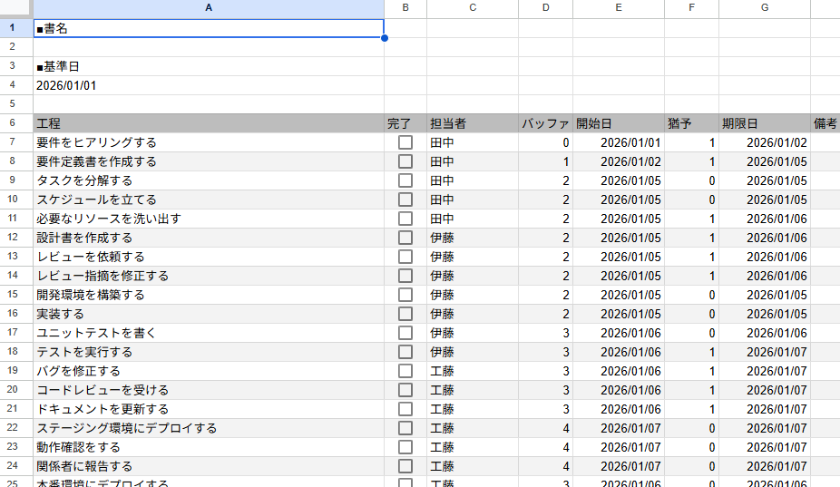
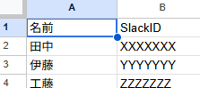

# README

Googleスプレッドシートに作成した月次タスク一覧表をGoogleカレンダーをトリガーに更新していく。

## 準備

### Googleカレンダー

カレンダーを新規作成し、雑誌の校了日を ***終日イベントとして*** 登録しておく。

### Googleスプレッドシート

最低限必要なシートは `TEMPLATE` と `MEMBER` という名前のシート2枚。

`TEMPLATE` シートは下図レイアウト。

| セル番地 | 内容 |
| --- | --- |
| `A2` | タスク名 |
| `A4` | 基準日 |

6行目にヘッダ。左7列は以下で固定。

| セル番地 | 内容 |
| --- | --- |
| `A6` | 工程 |
| `B6` | 完了 |
| `C6` | 担当者 |
| `D6` | バッファ |
| `E6` | 開始日 |
| `F6` | 猶予 |
| `G6` | 期限日 |

7行目以降は下記書式にしておくこと。

| 列 | 書式 |
| --- | --- |
| `B` | チェックボックス |
| `E`・`G` | 日付 |

`MEMBERS` シートは下図レイアウト。

- 1行目がヘッダ
- A列に名前
- B列にSlackID

### Google Apps Script

スクリプトエディタを開いて、サイドバー下端の `プロジェクトの設定` からスクリプト プロパティとして以下の3つを設定する。

- `CALENDAR_ID` …… GoogleカレンダーのID
- `SHEET_ID` …… GoogleスプレッドシートのID
- `WEBHOOK_URL` …… Slackアプリとしてチャンネルに投稿するためのURL。
    - https://api.slack.com/apps/ からアプリのページに移動して `Incoming Webhooks` セクションからチャンネルごとに発行する

## 開発者向け

### 環境構築

使用ツール：npm

> [!NOTE]
> TypeScriptで開発しているので初回は `npm install` すること。

### 開発手順

使用ツール：[clasp](https://github.com/google/clasp)

> [!NOTE]
>  まっさらな状態から開始するなら `clasp create-script` コマンドでプロジェクトを初期化し、生成された `.clasp.json` の `scriptId` 以外を[ここ](.clasp.json)に合わせて編集する。

[`./src`](./src/) 配下の `*.ts` ファイルを更新したら、

- `npm run push` でローカルの変更をGASエディタに反映し、
- `clasp open-script` でGASエディタを開く

